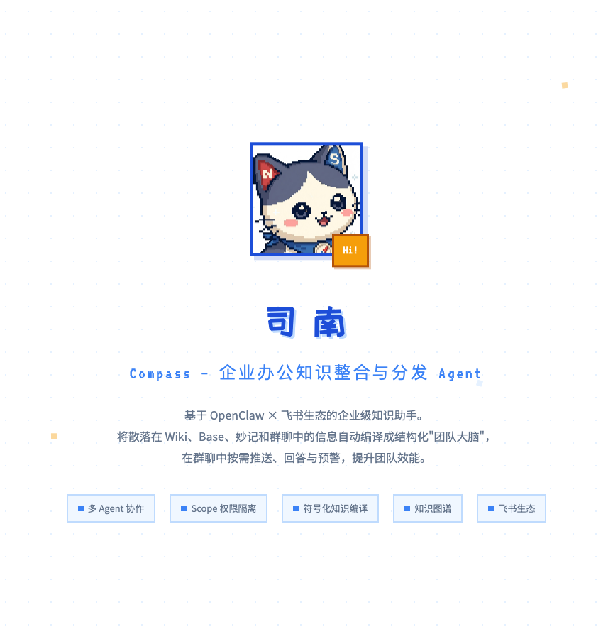
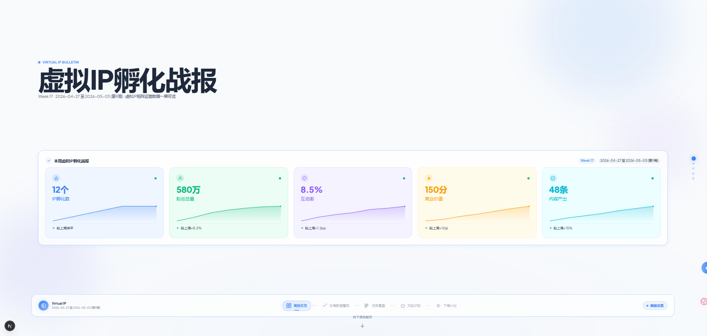
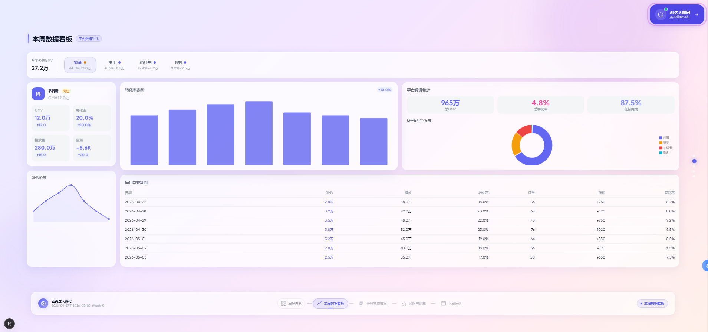
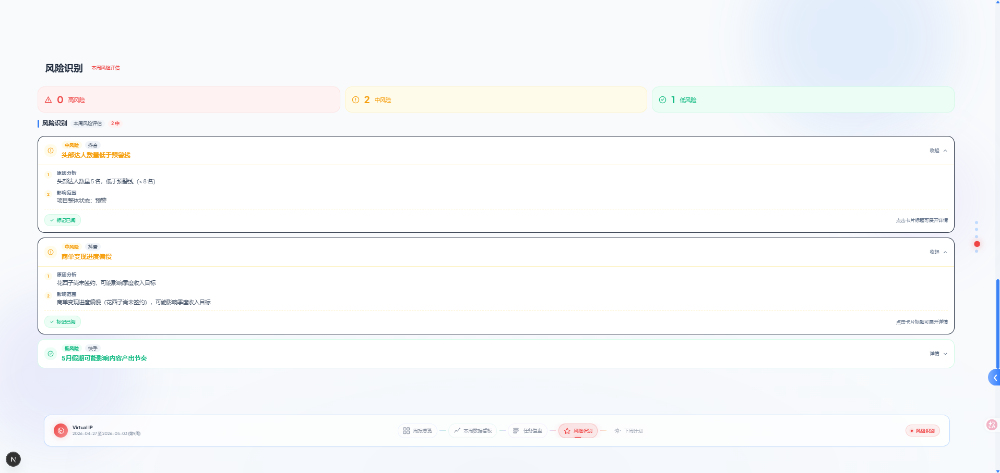
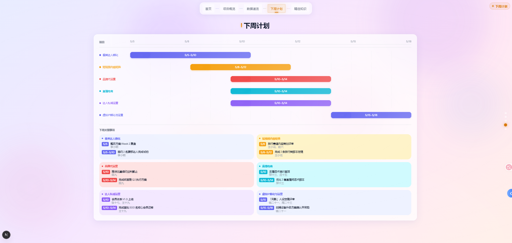
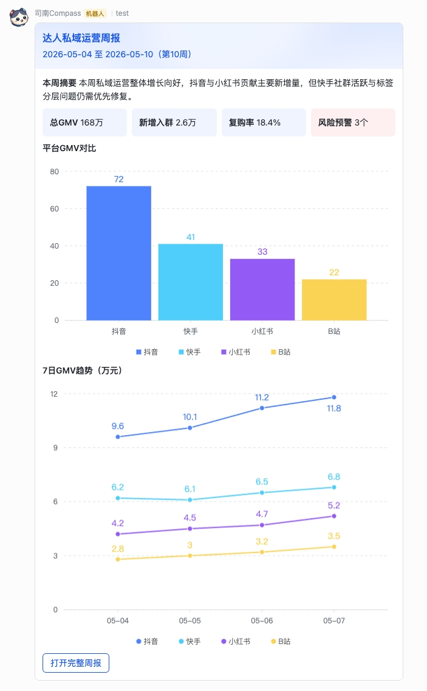

<div align="center">
  
  <h1>司南 Compass</h1>
  <p><strong>基于 OpenClaw × 飞书生态的企业级知识整合与分发 Agent</strong></p>
  <p>
    <a href="#核心能力">核心能力</a> •
    <a href="#系统架构">系统架构</a> •
    <a href="#快速开始">快速开始</a> •
    <a href="#项目展示">项目展示</a>
  </p>
</div>

---

## 项目总览

Compass（司南）是**基于 OpenClaw × 飞书生态的企业级知识助手**，面向所有**项目制工作场景**，将散落在飞书 Wiki、Base、妙记和群聊中的信息自动编译成结构化"团队大脑"，在群聊中按需推送、回答与预警，提升团队效能。

首发落地于 **MCN 事业部**，覆盖 6 个并行运营项目：垂类达人孵化、短视频内容矩阵、品牌代运营、直播电商、达人私域运营、虚拟 IP 孵化与运营。



---

## 核心能力

| 能力 | 触发方式 | 场景 |
|------|----------|------|
| **项目群知识查询** | 群内 @司南 提问 | 检索文档 SOP、查询 Base 数据、查看知识图谱 |
| **项目级周报推送** | 每周一 9:00 自动触发 | 汇总单项目上周 KPI、任务、风险，推送到项目群 |
| **部门级周报推送** | 每周一 9:05 自动触发 | 聚合全部项目状态 + Top3 精选知识，推送到部门群 |

**知识查询**
```
Before: 员工提问 → 找文档/翻表格/问同事 → 等待 → 获得答案（10min~1h）
After:  员工提问 → @司南 → 意图识别 → 知识检索/数据查询/图谱生成 → 秒级回复
```

**周报推送**
```
Before: PM 逐个群收集数据 → 复制粘贴汇总 → 手动写 Markdown → 上传 Wiki → 部门群粘贴（半天）
After:  weekly-reporter 周一 9:00 自动采集 → 生成项目周报 + 部门看板 → 归档 Wiki → 推送卡片（5 分钟）
```

---

## 核心亮点

### 亮点 1：OpenClaw 多 Agent 协作架构

Compass 采用 **4 个独立 Agent 协作** 的架构，通过 OpenClaw 框架实现职责分离与能力组合。

**多 Agent 架构的核心价值**：

| 维度 | 价值 |
|------|------|
| **单一职责** | 每个 Agent 只负责一件事，Prompt 聚焦，效果更稳定 |
| **独立演进** | wiki-manager 的同步逻辑升级不影响 qa-bot 的问答表现 |
| **故障隔离** | 局部 Agent 故障，其他 Agent 仍可正常工作 |
| **权限隔离** | 敏感数据同步（wiki-manager）与问答入口（qa-bot）物理隔离，Prompt 层面无交叉 |

**4 个 Agent 的分工**：

| Agent | 角色 | 核心能力 |
|-------|------|----------|
| **qa-bot** | 调度中心 / 唯一入口 | 意图识别、查询执行、Agent 调度、上下文感知 |
| **wiki-manager** | 知识图书管理员 | 飞书 Wiki/Base 同步、知识编译、图谱构建 |
| **weekly-reporter** | 周报工厂 | 定时采集数据、生成周报与部门看板、归档到飞书 Wiki |
| **card-builder** | UI 渲染层 | 将 Markdown/数据渲染为飞书消息卡片 |

qa-bot 作为调度中心，查询类自己处理，操作类委派给其他 Agent，类似微服务架构中的 API Gateway。

### 亮点 2：符号化知识编译（零向量库依赖）

Compass 不采用传统的 RAG 向量检索方案，而是采用 **"符号化知识编译（Symbolic Knowledge Compilation）"**：

```
传统 RAG                    Compass 符号化知识编译
─────────────────           ─────────────────────────
文档 → 分块 → Embedding      文档 → LLM 结构化提取
         ↓                          ↓
    向量数据库                  结构化 Markdown 页面
         ↓                          ↓
    相似度检索                  关键词匹配 + 图遍历
         ↓                          ↓
    Top-k 文本块                完整相关页面
         ↓                          ↓
    LLM 回答                    LLM 综合回答
```

**核心差异**：不是"检索片段再拼接"，而是让 LLM 在 ingest 阶段就把知识**编译**成结构化的、带交叉引用的 Wiki 页面，查询时直接读取完整的结构化页面做综合。

**为什么不用向量库？**

| 维度 | 向量库 RAG | Compass 符号化编译 |
|------|-----------|-------------------|
| **依赖** | 需要 embedding 模型 + 向量数据库 | 纯 Markdown 文件，零外部依赖 |
| **知识结构** | 文本块，无结构 | 结构化页面（实体/概念/来源），带 [[Wikilink]] 交叉引用 |
| **矛盾检测** | 无 | ingest 时自动检测新旧知识矛盾 |
| **可解释性** | "这块文本相似" | "这个实体在 5 个来源中被提及" |
| **可视化** | 难以可视化 | 直接生成可交互知识图谱 |
| **增量更新** | 重新 embedding | 只需重新 ingest 变更的页面 |
| **中文支持** | 依赖 embedding 模型质量 | 内置 CJK 双字滑动窗口匹配 |

### 亮点 3：自动化更新数据底座

wiki-manager 维护一条 **5 步同步流水线**，确保 qa-bot 回答的始终是最新知识：

```
Step 0: wiki-discover    扫描飞书 Wiki，自动发现新文档
Step 1: wiki-sync        对比 content_hash，只拉取变更文档 → raw_lark/wiki/
Step 2: base-sync        对比 content_hash，只拉取变更数据 → workspace/knowledge/data/
Step 3: wiki-ingest      LLM 将变更文档编译为结构化 wiki/（索引 + 实体 + 概念）
Step 4: wiki-graph       重建知识图谱（显式 [[wikilink]] 边 + LLM 语义推断隐式边）
```

**关键设计**：
- **增量同步**：content_hash 判断变更，未变更文件跳过，避免重复 LLM 调用
- **原始镜像保留**：raw_lark/ 保留飞书原文，wiki/ 保留编译后的结构化知识，物理隔离
- **数据与文档分离**：Base 数据保存为 JSON 供 data_query.py 读取，不进入 Markdown 编译流程
- **定时调度**：每周一 8:30 全量同步，每 6 小时增量检查

### 亮点 4：可交互前端卡片

Compass 最终触达用户的不只是文字，而是**结构化、可交互的前端呈现**：

**知识图谱可视化**

用户问"看看垂类达人孵化的知识图谱"，系统提取相关子图，生成可拖拽、可缩放、可点击查看详情的 vis.js 交互式网络图。

**飞书消息卡片**

weekly-reporter 调用 card-builder 将 Markdown 渲染为飞书消息卡片，直接推送到群聊：

```
【司南 · 上周战报 — 垂类达人孵化】
 新增签约达人 2 名，累计孵化中 8 名
 头部达人平均粉丝增长率 15%(↑ 3% vs 上周)
 商单转化 18%(目标 15% ✓)
 任务完成 6/8(品牌绑定 ✓ / 内容定位 ⏳ 延期)
 ⚠️ 风险点: 美妆赛道达人「小A」连续2周粉丝负增长
 本周计划: 素人面试 ×5 / 内容复盘会 ×1
 📎 详情: [完整周报飞书文档]
```

部门看板卡片则聚合全部项目状态（🟢🟡🔴）+ Top3 精选知识，一眼掌握全局。

### 亮点 5：Scope-Aware 权限隔离设计

**传统做法**：用户登录后根据角色判断权限（管理员/成员/访客）。

**Compass 做法**：**根据聊天群自动推断 scope**，用户甚至不用登录。你在"垂类达人孵化项目群"提问，系统默认只查该项目数据；你在"品牌代运营项目群"，看到的答案完全不同。

**更精细的是数据分级**：

| 信息类型 | 跨项目访问 | 示例 |
|----------|-----------|------|
| **公开信息** | 可回答 | "直播电商的 PM 是谁？" → "郑十三" |
| **敏感数据** | 拒答 | "直播电商上周 GMV 多少？" → 跨项目敏感数据未开放 |

公开信息（PM 姓名、项目成员、项目状态）可以跨项目回答；敏感 KPI（GMV、转化率、达人收入、客户满意度）严格按 scope 隔离。

**拒答不是 Prompt 层面的"请求 LLM 不要说"，而是物理层面的"工具层面就读不到数据"**——data_query.py 在读取前会检查 scope，跨项目数据直接不加载。

---

## 项目展示

### 前端看板总览

项目周报以可视化前端页面呈现，包含数据看板、风险预警、任务复盘、下周计划等模块。



### 数据看板

核心 KPI 指标可视化，支持周环比分析与趋势追踪。



### 风险识别

自动检测 KPI 连续下滑、任务延期等风险点，并在周报中醒目提示。



### 下周计划

基于当前项目状态，自动生成下周重点计划与行动项。



### 飞书卡片推送

weekly-reporter 调用 card-builder 将周报渲染为飞书消息卡片，直接推送到项目群，一屏读完，附带跳转完整文档链接。



---

## 快速开始

### 1. 环境准备

```bash
# 克隆项目
git clone <repo-url> compass-agent
cd compass-agent

# 安装 OpenClaw CLI
npm install -g openclaw

# 配置环境变量
# 复制 .env.example 为 .env 并填写飞书应用凭证
cp .env.example .env

# 配置 OpenClaw
# 复制示例配置文件并填入真实值
cp openclaw.json.example openclaw.json
# 编辑 openclaw.json，替换所有 YOUR_* 占位符
```

### 2. 使用示例数据体验（无需飞书）

项目中包含一套**完全虚构的示例数据**，可直接用于本地开发和体验：

```bash
# 示例数据位置
examples/
├── base/               # 模拟飞书 Base 多维表格数据（JSON）
└── wiki/               # 模拟飞书 Wiki 文档（Markdown）

# 方式一：直接放入 raw_lark 体验完整流程（无需飞书）
cp -R examples/wiki/* agents/wiki-manager/workspace/raw_lark/wiki/
cp -R examples/base/* workspace/knowledge/data/

# 方式二：快速体验数据查询
python -c "
import json
with open('examples/base/live-commerce/project_kpi.json') as f:
    data = json.load(f)
    print(f'共 {len(data)} 周数据，平均 GMV: {sum(d[\"总GMV\"] for d in data)/len(data):,.0f}')
"
```

详见 [`examples/README.md`](examples/README.md)。

### 3. 启动 Gateway

```bash
bash start-gateway.sh
```

Gateway 启动后监听 `127.0.0.1:18789`，Dashboard: `http://127.0.0.1:18789/`。

### 4. 初始化知识底座（连接真实飞书）

```bash
# 配置 wiki-manager 的数据源
# 编辑 agents/wiki-manager/workspace/config/sources.yaml
# 填入你的飞书 Wiki 空间 ID、节点 token、Base token 等

# 触发 wiki-manager 全量同步
openclaw run wiki-manager --prompt "刷新知识库"
```

### 5. 手动生成周报（测试）

```bash
# 触发 weekly-reporter 生成周报
openclaw run weekly-reporter --prompt "生成周报"
```

---

## 目录结构

```
compass-agent/
├── .openclaw/                           # OpenClaw 运行时配置
├── agents/                              # Agent 定义
│   ├── qa-bot/                          # 统一问答入口
│   ├── wiki-manager/                    # 知识底座同步引擎
│   │   └── workspace/
│   │       ├── config/
│   │       │   ├── sources.yaml         # 飞书数据源配置
│   │       │   └── sources.yaml.example # 配置模板
│   │       ├── raw_lark/                # 从飞书拉取的原始文档
│   │       │   ├── base/                # Base 多维表格原始数据
│   │       │   ├── minutes/             # 妙记原始数据
│   │       │   └── wiki/                # Wiki 原始 Markdown
│   │       ├── state/                   # 同步状态
│   │       └── tools/                   # 核心工具脚本
│   ├── weekly-reporter/                 # 周报合成助手
│   └── card-builder/                    # 卡片渲染层
├── demo/                                # 项目演示
│   ├── assets/images/                   # 截图与 Logo
│   ├── projects/                        # 项目看板模板
│   └── index.html                       # 产品说明页
├── examples/                            # 示例数据
│   ├── base/                            # 模拟 Base 多维表格数据
│   └── wiki/                            # 模拟 Wiki 原始文档
├── workspace/                           # 知识底座
│   ├── knowledge/
│   │   ├── wiki/                        # 符号化编译后的知识
│   │   ├── graph/                       # 知识图谱
│   │   └── data/                        # Base 结构化数据
│   └── memory/                          # Agent 记忆
├── start-gateway.sh                     # Gateway 启动脚本
├── openclaw.json                        # OpenClaw 根配置
├── openclaw.json.example                # 根配置模板
└── .env.example                         # 环境变量模板
```

---

## 技术栈

| 层级 | 技术 |
|------|------|
| Agent 框架 | OpenClaw（skill-based 调用链） |
| 知识编译 | 符号化知识编译（ingest.py：LLM 结构化提取 → Markdown 页面） |
| 知识检索 | 图增强检索（query.py：CJK 关键词匹配 + graph.json 邻居扩展） |
| 数据查询 | Python + lark-cli Base API + JSON 结构化过滤 |
| 知识图谱 | build_graph.py（两-pass 建图 + Louvain 社区检测）+ vis.js 可视化 |
| 数据同步 | 飞书 Wiki API + Base API + content_hash 增量判断 |
| 消息卡片 | 飞书消息卡片 JSON（card-builder 渲染） |
| 前端看板 | Next.js + React + Chart.js + Tailwind CSS |
| 部署 | 本地 Gateway（可扩展为云端） |

---

## 价值前景

| 指标 | 提升 |
|------|------|
| 信息检索时间 | 从 5-15 分钟 → **10 秒** |
| 新人上手成本 | 从"翻遍 Wiki" → **@司南 直接问** |
| 跨项目数据泄露风险 | 从"依赖人判断" → **系统自动拦截** |
| 周报撰写时间 | 从半天 → **数据自动聚合 + LLM 润色** |
| 知识沉淀 | 从"散落在各处" → **统一知识底座 + 图谱关联** |


---

<div align="center">
  <p>Made with ❤️ by MCN 事业部 · 星澜传媒</p>
</div>
